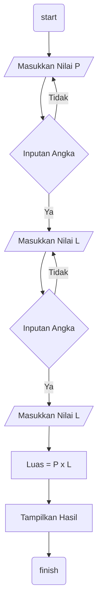

```mermaid
    flowchart TD;
   
    A(start) --> B[/Masukkan Nilai P/];
    B --> C{Inputan Angka}
    C -- Tidak --> B
    C -- Ya -->D[/Masukkan Nilai L/];
    D --> E{Inputan Angka}
    E -- Tidak --> D
    E -- Ya -->F[/Masukkan Nilai L/];
    F --> G[Luas = P x L];
    G --> I[Tampilkan Hasil];
    I --> J(finish);
```

