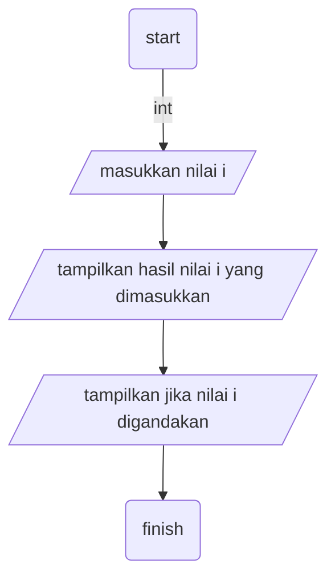

```mermaid
    flowchart TD;
    A(start) --int--> B[/masukkan nilai i/];
    B --> C[/tampilkan hasil nilai i yang dimasukkan/];
    C --> D[/tampilkan jika nilai i digandakan/]
    D --> E(finish);

```