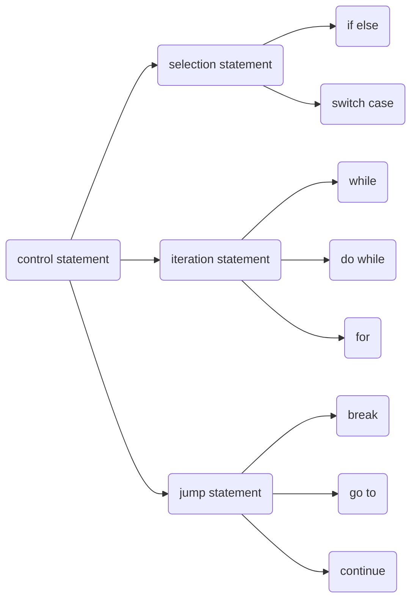

```mermaid
    flowchart LR;
    A("control statement") --> B("selection statement");
    A --> C("iteration statement");
    A --> D("jump statement");
    B --> B1("if else");
    B --> B2("switch case");
    C --> C1("while");
    C --> C2("do while");
    C --> C3("for");
    D --> D1("break");
    D --> D2("go to");
    D --> D3("continue");
```