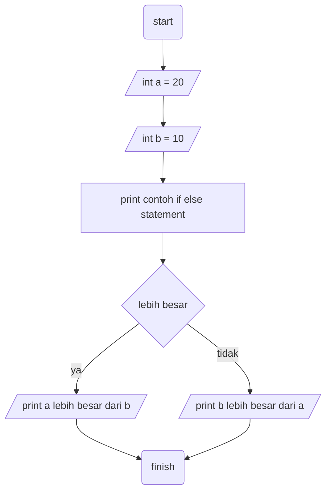

```mermaid
    flowchart TD;
    A(start) --> B[/int a = 20/];
    B --> C[/int b = 10/];
    C --> D[print contoh if else statement];
    D --> E{lebih besar};
    E --ya--> F[/print a lebih besar dari b/];
    E --tidak--> G[/print b lebih besar dari a/];
    F --> H(finish)
    G --> H
```