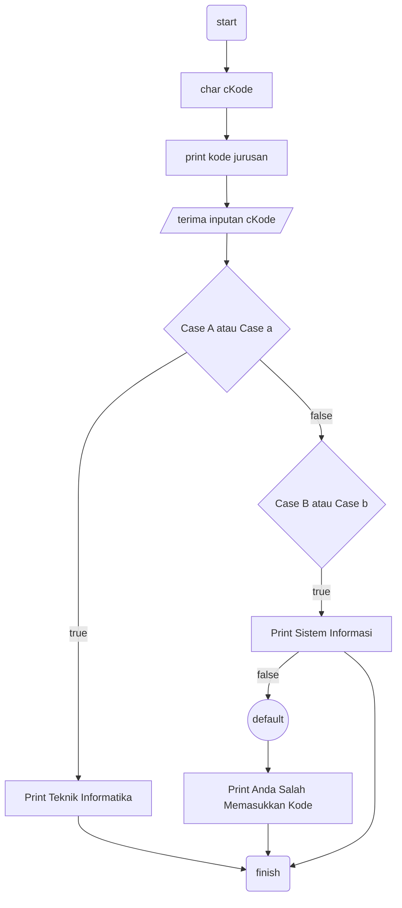

```mermaid
    flowchart TD;
    A(start) --> B[char cKode];
    B --> C[print kode jurusan];
    C --> D[/terima inputan cKode/];
    D --> E{Case A atau Case a};
    
    E --true-->G[Print Teknik Informatika]
    
    E  --false-->H{Case B atau Case b}
    
    H --true--> J[Print Sistem Informasi];
    
    J --false--> L((default));
    
    L -->M[Print Anda Salah Memasukkan Kode]
    M & G & J --> N(finish);
```