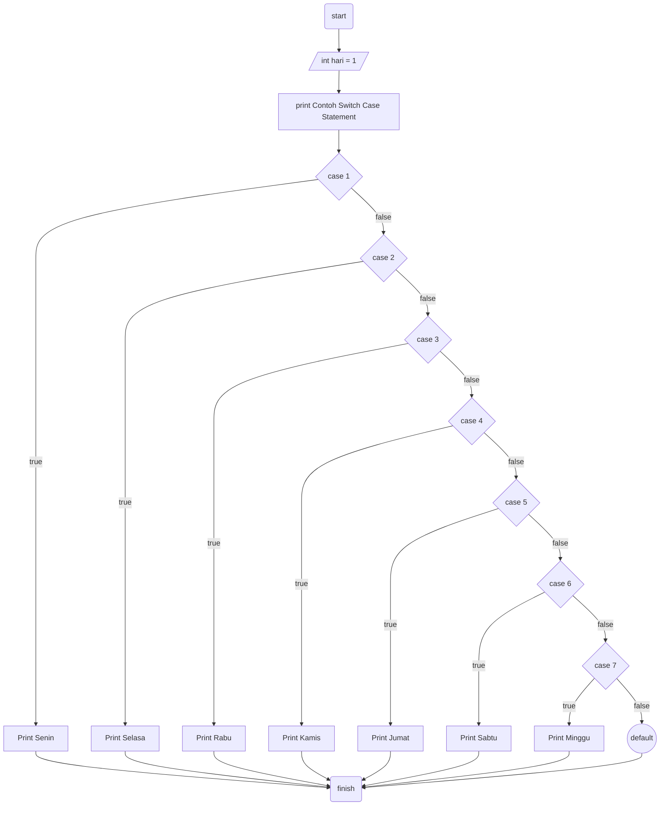

```mermaid
    flowchart TD;
    A(start) --> B[/ int hari = 1 /];
    B --> C[print Contoh Switch Case Statement];
    C --> D{case 1};
    D --true--> E[Print Senin];
    D --false--> F{case 2};
    F --true--> G[Print Selasa];
    F --false--> H{case 3};
    H --true-->I[Print Rabu];
    H --false-->J{case 4};
    J --true-->K[Print Kamis];
    J --false-->L{case 5};
    L --true-->M[Print Jumat];
    L --false-->N{case 6};
    N --true-->O[Print Sabtu];
    N --false-->P{case 7};
    P --true-->Q[Print Minggu];
    P --false-->R((default));
    E & G & I & K & M & O & Q & R -->S(finish);

```